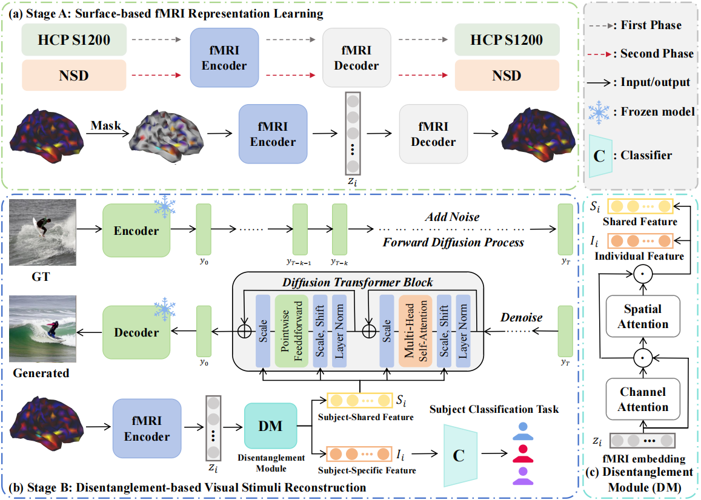
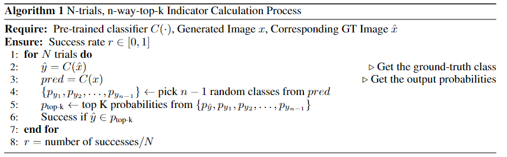

# BrainX: A Universal Brain Decoding Framework with Feature Disentanglement and Neuro-Geometric Representation Learning

## Abstract
Decoding visual stimuli from human brain activity is a fundamental challenge in cognitive neuroscience and neuroimaging. While recent advances in deep learning have significantly improved the performance of fMRI-to-image decoding, most existing methods overlook the issue of inter-subject variability in fMRI data, which leads to poor generalization across subjects. Current approaches often rely on partially shared model architectures that offer limited generalization and still require subject-specific components, restricting their applicability to unseen subjects. To address this limitation, we propose BrainX, a universal brain decoding framework that constructs a unified fMRI encoder and image generator to achieve subject-agnostic modeling. Specifically, we introduce a feature disentanglement mechanism that extracts subject-shared features from the fMRI embeddings, which are then fed into the image generator to reconstruct visual stimuli. This design eliminates the need for subject-specific models and significantly enhances cross-subject generalization. Additionally, we develop a neuro-geometric fMRI representation learning method that projects 3D cortical structures onto a 2D surface space, effectively mitigating the inaccuracies caused by imprecise geodesic distance estimation in 3D Euclidean space. Extensive experiments on the Natural Scenes Dataset (NSD) demonstrate that BrainX consistently outperforms existing state-of-the-art methods across three decoding settings: within-subject, cross-subject with finetuning, and cross-subject without finetuning.
## 1. Method Overview


Overview of our proposed method. (a) Stage A employs the MAE framework to learn fMRI representation from 2D mesh data through two-phase training process. Both the fMRI Encoder and fMRI Decoder are based on a Vision Transformer; (b) Stage B involves a specially designed Disentanglement Module to extract subject-shared features from fMRI embeddings, which are then used as input to the Diffusion Transformer for visual stimulus reconstruction; (c) Attention-based Disentanglement Module.
## 2. Experiments and more results
### 2.0 Datasets
In this study, 3T tfMRI data from [HCP S1200](https://db.humanconnectome.org/data/projects/HCP_1200) was used for the pre-training of StageA, and [NSD](https://naturalscenesdataset.org/) was used for evaluating the performance of the decoding method. The NSD dataset captures fMRI images of 8 subjects when they viewed over 70,000 high-resolution natural scene images. We used the data from four participants (subject 1, 2 ,5 ,7) who completed all the designed trials (10,000 images in 30,000 trials). 
### 2.1 Evaluation Metrics
This paper adopts the N-way-top-K accuracy classification task to evaluate the semantic correctness of the results. The N-way-top-K metric is designed based on a pre-trained ImageNet-1K classifier. During the evaluation process, both the generated image and the corresponding ground truth image are fed into the classifier. Semantic correctness is determined by checking whether the top-K predictions among N randomly selected classes match the true class. In this study, we employ four metrics, including 50-way-top-1, 50-way-top-5, 100-way-top-1, and 100-way-top-5. SSIM and PCC are also used to evaluate the fine-grained quality of decoded images.


### 2.2 Experiments Setup
In this work, all methods were implemented using PyTorch, with the AdamW optimizer employed for training. For Stage A, we adopted a cosine decay strategy for learning rate scheduling, starting with an initial learning rate of 1.5e-4. The fMRI Encoder was configured with a depth of 12 and an embedding dimension of 1024, while the fMRI Decoder was set to a depth of 12 and an embedding dimension of 512. For the visual stimuli reconstruction stage, we utilized a pre-trained DiT-XL-2-256x256 model. For the NSD dataset division, we followed the standard practice established in prior work [brain-diffuser](https://github.com/ozcelikfu/brain-diffuser). Hyperparameter tuning was conducted using a grid search approach, with the optimal value of lambda1 set to 1e-3. These configurations ensure a fair and reproducible evaluation of our method while aligning with established practices in the field.

## 3. Training Procedure

### 3.0 Setting Environments

Create and activate conda environment named ```BrainX``` from this ```env.yaml```
```sh
conda env create -f env.yaml
conda activate BrainX
```

### 3.1 Stage A: Surface-based fMRI Representation Learning
#### Overview
In StageA, we first pre-train MAE with a MSE loss to learn fMRI representations from unlabeled fMRI data from HCP S1200. Fine-tuning is then made on the NSD dataset that needs to be used for StageB.
#### Preparing
First of all, you need to modify the relevant data access code in ./StageA_MAE/dataset_folder.py and change the data address in train file to your own storage path.
All fMRI data used is registered to fsaverage3 642 size space, make sure that the data used is processed correctly!!!
#### Training Model
After entering the StageA_MAE folder, you can run
```
python run_mae_pretraining.py 
```
to pretrain the model by youself.
Hyperparameters can be modified in the run_mae_training.py file. After the pretraining is complete, the model checkpoint will be saved in the results folder.

Once you have the pre-trained model, you can run
```
python run_mae_finetuning.py 
```
to finetune the model on the NSD dataset. 

### 3.2 Stage B: Disentanglement-based Visual Stimuli Reconstruction
#### Overview 
We employ the pretrained DiT model to reconstruct visual stimuli from the disentangled fMRI representations.
#### Preparing
We use the NSD dataset in this Stage. Please change the relevant data path to your path in the train.py.
In addition, place the pre-trained DiT checkpoint as well as the pre-trained MAE checkpoint under ./StageB_DiT/pretrains.
#### Tuning Model
After entering the StageB_DiT folder, you can run the following commands to finetune the pretrained DiT.
```
python code/train.py
```

## 4 Generate Images with Trained Checkpoints
Run this stage with trained checkpoints:
```sh
python code/sample.py
```
The results and generated samples will be saved locally at ```./eval``` .
## Acknowledgements

## Citation
Please cite our paper if the code should be useful for you.


